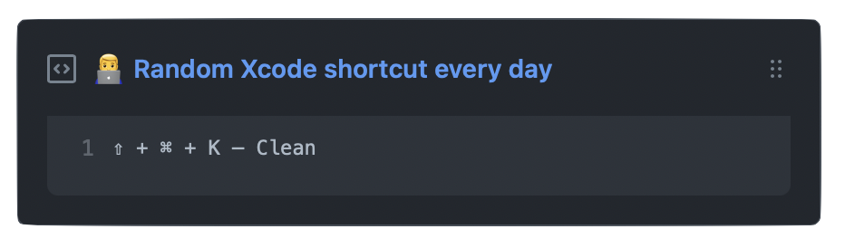

  
  <h3 align="center">shortcut-box</h3>
  
👨‍💻 Update a pinned gist to contain random IDE shortcut

## Setup

1. Create a new public [GitHub Gist](https://gist.github.com).
1. Create a [token](https://github.com/settings/tokens/new) with the `gist` scope and copy it.
3. Fork this repo
4. Go to the repo **Settings > Secrets**
5. Add the following environment variables:
   - **GH_TOKEN:** The GitHub token generated above.
   - **GIST_TOKEN**: The ID portion from your gist url: `https://gist.github.com/artemnovichkov/`**c24fd619278b272471af51f06c1ce6b2**.
 
 To add support IDEs except Xcode, add another JSON with shortcuts and pass its name in [workflow](https://github.com/artemnovichkov/shortcut-box/blob/69bf2231c5c96c11924854d7f562a49b7b80a503/.github/workflows/schedule.yml#L16).
 

## Author

Artem Novichkov, novichkoff93@gmail.com

## License

The project is available under the MIT license. See the LICENSE file for more info.
